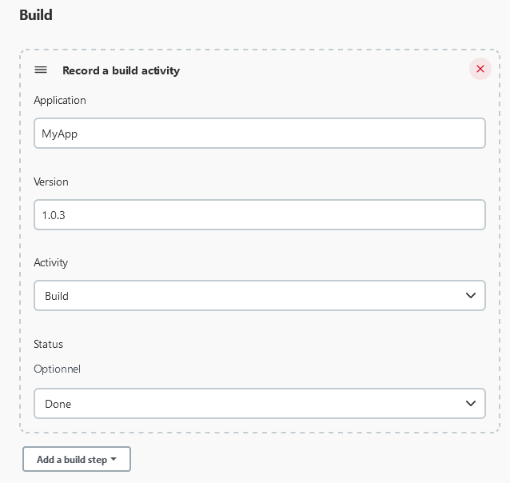

# DevOps Portal Jenkins Plugin

A Jenkins Dashboard Plugin with many features

## ⚡ Manage Environments

In Jenkins configuration :


Configure environments :


- An unique label
- A category (like production, staging, ...)
- An optional monitoring URL
- A time interval (in minutes) between two monitoring checks
- A feature to accept invalid certificates (for monitoring URL)

## 🚀 Manage Run Operations

**View** > **+ button** > View type: **Run Dashboard**

Dashboard :


### Report run operation using Jenkins GUI


### Report run operation with pipeline script

```
reportRunOperation(
    targetService: string,      // Name for target environnement to deploy to
    applicationName: string,    // Name of application deployed
    applicationVersion: string, // Version of application deployed
    operation: string,          // Operation code
    status: boolean,            // Status
    tags?: string               // Optional: comma-separated list
)
```

Operation codes:

- DEPLOYMENT
- ROLLBACK

## 📦 Manage Build Activities

**View** > **+ button** > View type: **Build Dashboard**

Dashboard :


### Report build activity using Jenkins GUI



### Report build activity with pipeline script

Pipeline script :

```
reportBuild(
    applicationName: string,       // Name of application built
    applicationVersion: string,    // Version of application built
    applicationComponent: string   // Name of application component built
    artifactFileName?: string,     // Optional: full path to generated artifact
    artifactFileSize?: long,       // Optional: file size of generated artifact
    dependenciesToUpdate?: int     // Optional: nomber of outdated dependencies
)
```

```
reportUnitTest(
    applicationName: string,       // Name of application built
    applicationVersion: string,    // Version of application built
    applicationComponent: string   // Name of application component built
    testCoverage?: float,          // Optional: coverage ratio (between 0-1)
    testsPassed?: int,             // Optional: number of passed tests
    testsFailed?: int,             // Optional: number of failed tests
    testsIgnored?: int             // Optional: number of skipped tests
)
```

```
reportImageRelease(
    applicationName: string,       // Name of application built
    applicationVersion: string,    // Version of application built
    applicationComponent: string   // Name of application component built
    registryName?: string,         // Optional: registry server name
    imageName?: string,            // Optional: image name released
    tags?: string                 // Optional: comma-separated list of image's tags
)
```

Activity codes :

- `BUILD` Application build
- `UT` Unit Tests
- `QA` Quality Audit
- `SECU` Security Audit
- `DEPLOY` Deployment
- `PERF` Performance Tests

Status codes :

- `PENDING` Pending
- `DONE` Done
- `UNSTABLE` Unstable
- `FAIL` Fail