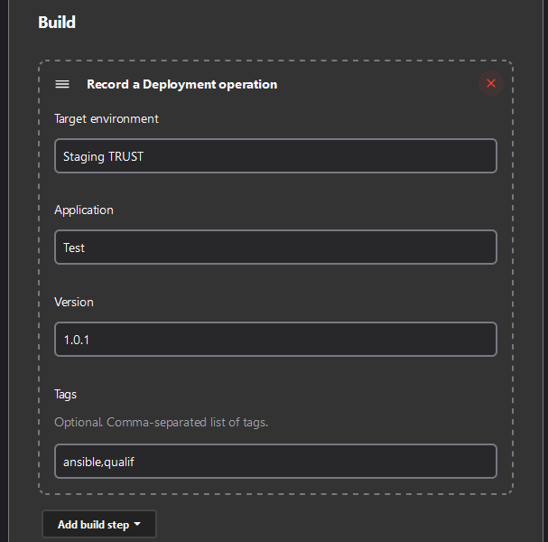
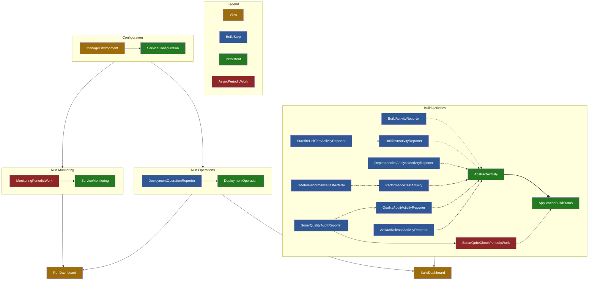

# DevOps Portal Jenkins Plugin
--- *Brings some DevOps to your Jenkins !*


Bring together all the information about the **build** of your applications on a single dashboard:


And allows you to check the deployment of your applications on your **run** environments and monitor the availability of services:


This plugin allows you to centralize in Jenkins several functionalities necessary for a good DevOps approach:

|  Step   | Feature                                                                                                                                              |
|:-------:|------------------------------------------------------------------------------------------------------------------------------------------------------|
|  CODE   | As the development progresses, the plugin offers a synthetic view to track the progress of the build of the different versions of your applications. |
|  BUILD  | It shows the status of each build and monitors that artifacts do not exceed a critical size.                                                         |
|  TEST   | It gathers results from unit tests and code quality audits into a single view (shows Sonar metrics in Jenkins)                                       |
| RELEASE | It keeps track of releases made and that artifacts are properly published and tagged on repositories.                                                |
| DEPLOY  | It also keep track of all deployments performed on different environments directly into Jenkins.                                                     |
| OPERATE | Furthermore, it centralizes application performance testing (especially with JMeter)                                                                 |
| MONITOR | Finally, a dashboard allows to monitor uptime for HTTP(S) services and certificate information.                                                      |


## <a name="table-of-contents"></a> Table of Contents

1. [Installing Prerequisites](#section-setup)
2. [Manage 📦 **BUILD activities**](#section-build)
   1. [Build artifacts](#activity-build)
   2. [Unit testing](#activity-ut)
   3. [Code Quality & Security Audit](#activity-quality)
   4. [Dependencies Analysis](#activity-dependencies)
   5. [Performance/load testing](#activity-performance)
   6. [Release container image](#activity-release)
3. [Configure services environments](#section-manage)
4. [Manage 🚀 **RUN operations**](#section-run)
5. [Pipeline Example](#section-sample)
6. [Setup as developer](#section-dev)
7. [Application architecture](#section-archi)

## <a name="section-setup"></a> Installing Prerequisites

- Jenkins version: >= 2.346.1
- Supported translations: 🇫🇷 🇬🇧
- Install and enable plugin from Jenkins Administration

## <a name="section-build"></a> 📦 Manage Build Activities

This plugin also allow to track many metrics of the software development.

Create new dashboard using: `View` > `+ button` > View type: `Build Dashboard`

Example Dashboard :


The dashboard bring together much information:

- List all applications and versions
- Display last run with status
- If possible, display related VCS branch and commit (only GIT actually)
- Display the last deployment target environment
- Also, it can display a lot of activities:
  - 🔹 **[Build artifacts](#activity-build)**: artifact file size
  - 🔹 **[Unit testing](#activity-ut)**: number of passed/failed/skipped tests, coverage and score
  - 🔹 **[Code Quality & Security Audit](#activity-quality)**: designed to gather SonarQube metrics into Jenkins,
    it displays the Quality Gate status, number of bugs/vulnerabilities/hotspot, code duplication and code
    volume. Hence, it also displays scores according to the quality gate.
  - 🔹 **[Dependencies Analysis](#activity-dependencies)**: number of outdated and vulnerable dependencies
  - 🔹 **[Performance/load testing](#activity-performance)**: score and Quality Gate status, number of load request and
    the average response time (in milliseconds)
  - 🔹 **[Release](#activity-release)**: keep track of container images or artifacts built and published to a repository

**Note**: you can filter applications to display on the dashboard using `Edit View`. Regular expressions are supported.

Once the dashboard is created, you can feed it using an **Activity Reporter**.

### <a name="activity-build"></a> 🔹 Activity: Artifact build

You can report build activities using a special build step.
In the `Configure` screen of a job, click on `Add Build Step` button and choose one among:

| Build step              |
|-------------------------|
| `Record a build report` |

Run with pipeline script (DSL):

```groovy
reportBuild(
    applicationName: String,             // Name of application built
    applicationVersion: String,          // Version of application built
    applicationComponent: String,        // Name of application component built
    artifactFileName: String,            // Path to generated artifact
    artifactFileSizeLimit: int = 0       // Optional: put a limit on the artifact file size, causing the build to fail if exceeded
)
```

### <a name="activity-ut"></a> 🔹 Activity: Unit Test

You can report build activities using a special build step.
In the `Configure` screen of a job, click on `Add Build Step` button and choose one among:

| Build step                    |
|-------------------------------|
| `Record a UT report manually` |
| `Record a Surefire UT report` |

Run with pipeline script (DSL):

```groovy
reportUnitTest(
    applicationName: String,          // Name of application built
    applicationVersion: String,       // Version of application built
    applicationComponent: String,     // Name of application component built
    testCoverage: float = 0.0,        // Optional: coverage ratio (between 0-1)
    testsPassed: int,                 // Number of passed tests
    testsFailed: int,                 // Number of failed tests
    testsIgnored: int                 // Number of skipped tests
)
```

#### Using with Surefire

Required actions:
- Install plugin: [Maven Integration](https://plugins.jenkins.io/pipeline-maven/) and [Pipeline Maven Integration](https://plugins.jenkins.io/pipeline-maven/)
- Configure a **Maven installation** in Global Tools configuration page

Then you can record Surefire test reports using:

```groovy
withMaven() {
    sh "mvn test"
}
reportSurefireTest(
    applicationName: String,       // Name of application built
    applicationVersion: String,    // Version of application built
    applicationComponent: String,  // Name of application component built
    surefireReportPath: String     // Path to the Surefire report file
)
```

###  <a name="activity-quality"></a> 🔹 Activity: Code Quality audit

You can report build activities using a special build step.
In the `Configure` screen of a job, click on `Add Build Step` button and choose one among:

| Build step                         |
|------------------------------------|
| `Record a quality audit manually`  |
| `Record a SonarQube quality audit` |

Run with pipeline script (DSL):

```groovy
reportQualityAudit(
    applicationName: String,                   // Name of application built
    applicationVersion: String,                // Version of application built
    applicationComponent: String,              // Name of application component built
    bugCount: int,                             // Number of bugs identified
    bugScore: String,                          // Choose amount: "A", "B", "C", "D", "E"
    vulnerabilityCount: int,                   // Number of vulnerabilities identified
    vulnerabilityScore: String,                // Choose amount: "A", "B", "C", "D", "E"
    hotspotCount: int,                         // Number of security hotspot identified
    hotspotScore: String,                      // Choose amount: "A", "B", "C", "D", "E"
    duplicationRate: float,                    // Number of bugs identified
    testCoverage: float,                       // Test coverage ratio (between 0-1)
    linesCount: long,                          // Number of source code lines
    qualityGatePassed: boolean                 // Indicate if the quality gate is reached
)
```

#### Using with SonarQube

Required actions:
- Install plugin: [Maven Integration](https://plugins.jenkins.io/pipeline-maven/) and [Pipeline Maven Integration](https://plugins.jenkins.io/pipeline-maven/)
- Install plugin: [SonarQube Scanner](https://plugins.jenkins.io/sonar)
- Configure a **Maven installation** in Global Tools configuration page
- Configure a **SonarQube server** in System Configuration page
- Configure a **Secret text credential** in Manage Credentials page

Then you can record SonarQube audit reports using:

```groovy
withSonarQubeEnv(credentialsId: 'XXXXX', installationName: 'My SonarQube Server') {
    withMaven() {
        sh "mvn sonar:sonar"
    }
    reportSonarQubeAudit(
        applicationName: String,               // Name of application built
        applicationVersion: String,            // Version of application built
        applicationComponent: String,          // Name of application component built
        projectKey: String                     // Project identifier on SonarQube server
    )
}
```

###  <a name="activity-dependencies"></a> 🔹 Activity: Dependency analysis

You can report build activities using a special build step.
In the `Configure` screen of a job, click on `Add Build Step` button and choose one among:

| Build step                       |
|----------------------------------|
| `Record a dependencies analysis` |

If you are using MAVEN as dependencies manager, you need to add this plugin in your pom:

```xml
<plugins>
    <plugin>
        <groupId>org.owasp</groupId>
        <artifactId>dependency-check-maven</artifactId>
        <version>7.3.2</version>
        <executions>
            <execution>
                <goals>
                    <goal>check</goal>
                </goals>
            </execution>
        </executions>
    </plugin>
</plugins>
```

Run with pipeline script (DSL):

```groovy
reportDependenciesAnalysis(
    applicationName: String,       // Name of application built
    applicationVersion: String,    // Version of application built
    applicationComponent: String,  // Name of application component built
    manager: String,               // Only 'MAVEN' is supported actually
    manifestFile: String,          // Path to project manifest file (pom.xml)
    managerCommand: String = null  // Optional: shell command to run the manager
                                   // If not provided, the plugin will try to guess it 
)
```

###  <a name="activity-performance"></a> 🔹 Activity: Performance test

You can report build activities using a special build step.
In the `Configure` screen of a job, click on `Add Build Step` button and choose one among:

| Build step                              |
|-----------------------------------------|
| `Record a performance test`             |
| `Record a performance test with JMeter` |

Run with pipeline script (DSL):

```groovy
reportPerformanceTest(
    applicationName: String,       // Name of application built
    applicationVersion: String,    // Version of application built
    applicationComponent: String,  // Name of application component built
    testCount: int,                // Number of tests executed
    sampleCount: int,              // Number of samples (API calls) for all tests
    errorCount: int                // Number of error encountered
)
```

#### Using with JMeter

```groovy
reportJMeterPerformanceTest(
    applicationName: String,       // Name of application built
    applicationVersion: String,    // Version of application built
    applicationComponent: String,  // Name of application component built
    jmeterReportPath: String       // Path to JMeter XML result file
)
```

###  <a name="activity-release"></a> 🔹 Activity: Application release

You can report build activities using a special build step.
In the `Configure` screen of a job, click on `Add Build Step` button and choose one among:

| Build step                   |
|------------------------------|
| `Record an artifact release` |

Run with pipeline script (DSL):

```groovy
reportRelease(
    applicationName: String,       // Name of application built
    applicationVersion: String,    // Version of application built
    applicationComponent: String,  // Name of application component built
    repositoryName: String,        // Registry server hostname
    artifactName: String,          // Image name released
    tags: String = null,           // Optional: comma-separated list of image's tags
                                   // Eg. "docker", "artifactory", "nexus", "ftp"
    artifactURL: String = null     // Optional: a link to the release        
)
```

## <a name="section-manage"></a> Configure Environments

After the installation, a link allows to configure managed environments in **Jenkins Administration**:


Then you can configure each environment to manage:


You have to provide:
- An unique label
- A category (like production, staging, ...)
- An optional monitoring URL
- A time interval (in minutes) between two monitoring checks
- A flag to accept invalid certificates (for monitoring URL)

## <a name="section-run"></a> 🚀 Manage Run Operations

### Dashboard

Since you configured your environments, you can create a dashboard.

Create new dashboard using: `View` > `+ button` > View type: `Run Dashboard`

Example dashboard :


The dashboard provides some information:

- Display all environments grouped by categories
- Display a status icon according to monitoring result:

|                        Icon                         | Meaning                                                        |
|:---------------------------------------------------:|----------------------------------------------------------------|
|  | Successful connection                                          |
|    | Connection failure                                             |
|        | HTTPS configuration issue (expired or self signed certificate) |
|  | Monitoring is disabled                                         |

- Show the certificate expiration date (if the given monitoring URL is HTTPS) and status:

|                        Icon                        | Meaning                          |
|:--------------------------------------------------:|----------------------------------|
|      | Certificate valid and up to date |
|  | Expired certificate              |
|  | Unchecked certificate            |


- Display the last deployment information: application, version and jenkins run
- Also display the deployment tags, which allows to describe the deployment process
  (Eg. `ansible`, `ssh`, `ftp` ...)

**Note**: you can filter environment categories to display on the dashboard using `Edit View`. Regular expressions are supported.

Once the dashboard is created, you can feed it using an **Operation Reporter**.

#### Report a Deployment operation using the Jenkins interfaces (GUI)

You can report Deployment operations, using a special build task.
In the `Configure` screen of a job, click on `Add Build Step` button and choose
`Record a Deployment operation`.



You have to fill in:

- The target environment name (declared previously in `Manage Environments`)
- The name of concerned application
- The version of concerned application
- Optionally, you can add tags to describe the operation (comma-separated)

#### Run with pipeline script (DSL):

The report can also be made using a Groovy Pipeline script using this command:

```groovy
reportDeployOperation(
    targetService: String,        // Name for target environment to deploy to
    applicationName: String,      // Name of application deployed
    applicationVersion: String,   // Version of application deployed
    tags: String = null           // Optional: comma-separated list
)
```

## <a name="section-sample"></a> Samples

| Sample                               | Content                                                         |
|--------------------------------------|-----------------------------------------------------------------|
| [Plugin build pipeline](Jenkinsfile) | Provides a complete example of integrating all BUILD activities |

## <a name="section-dev"></a> Setup as Developer

1. Checkout from: https://github.com/rbello/jenkins-plugin-devops-portal.git
2. Recommended IDE is **Intellij IDEA**
3. JDK 11 is preferred (newer JDK may introduce serialization issues)
4. The minimal Jenkins version is: 2.346.1
5. Run locally with: `mvn hpi:run -Djetty.port=5000`
6. Create HPI package with: `mvn hpi:hpi`
7. Suggest any change by Forking the project and opening a Pull Request
8. Release with: `mvn release:prepare release:perform -Dusername=****** -Dpassword=******`

## <a name="section-archi"></a> Application architecture



## Troubleshooting

To debug plugin behavior, configure a jenkins logger on the class:
`io.jenkins.plugins.devopsportal`

## Author & Licence

This plugin is provided by Rémi BELLO \
https://github.com/rbello/jenkins-plugin-devops-portal

**Licence** \
GNU GENERAL PUBLIC LICENSE \
Version 3, 29 June 2007

## TODO

Integration testing:

- [ ] Ensure JenkinsUtils.getBuild() works with Multibranch Pipelines (!!! FAILED)
- [ ] Check behavior with slaves workers (accessing local files)
    - [x] BuildActivityReporter
    - [x] SurefireUnitTestActivityReporter
    - [ ] JMeterPerformanceTestActivityReporter
    - [ ] DependenciesAnalysisActivityReporter
- [x] SonarQubeAudit
  - [ ] Test with invalid projectKey
  - [ ] Test with invalid server
- [ ] Unstable Maven dependency analysis : stucked with vulnerabilities
- [x] SonarQube audit : 3 vulnerabitilies, 4 bugs
- [x] Build dashboad, Unit tests, change icon with detail to "open-outline"
- [x] SurefireUnitTestActivityReporter: allow wildcard for file selection
- [ ] Date bug on BuildDashboard

Next features:

- [ ] Report dependencies analysis: implements with NPM
- [ ] DependenciesAnalysisActivityReporter: automatic population with Annotation detection