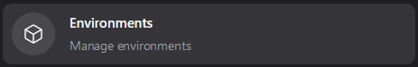
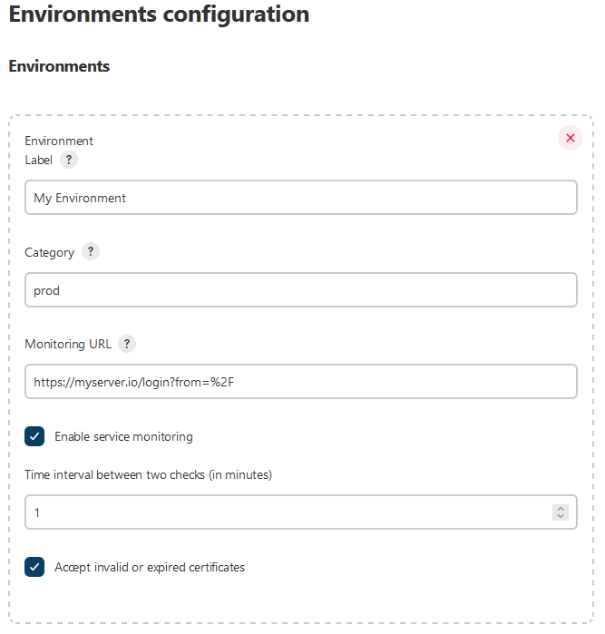
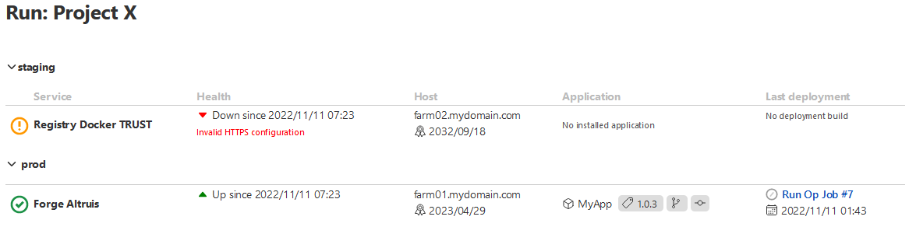
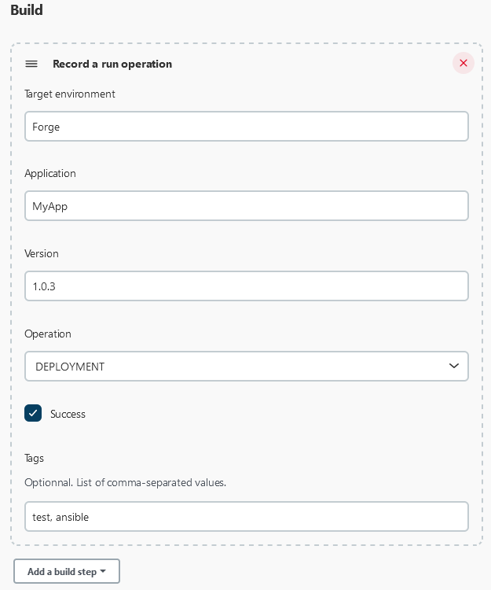
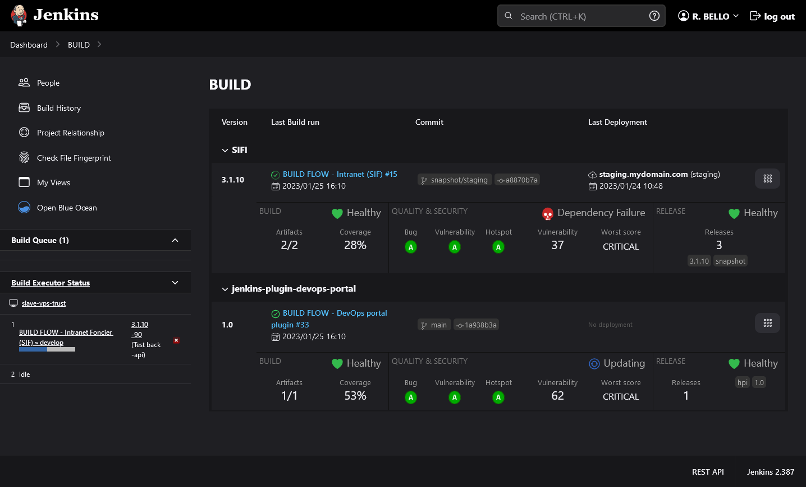
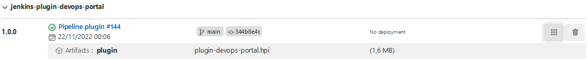
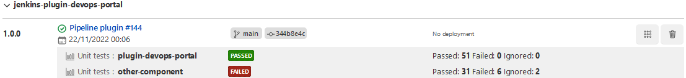
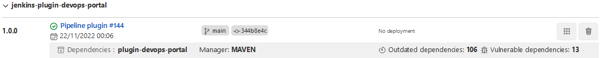
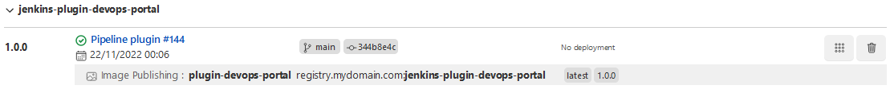
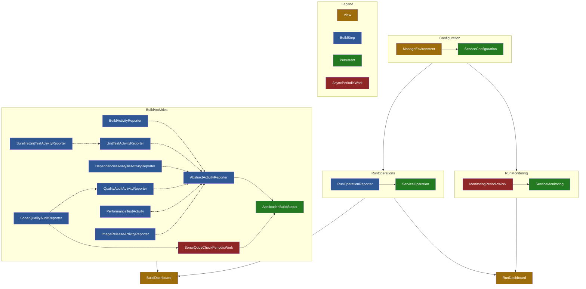

# DevOps Portal Jenkins Plugin

A Jenkins Dashboard Plugin with many features :

1. Offer a specific **dashboard** to track 🚀 **[RUN operations](#section-run)**
    - Environments **monitoring** (service availability)
    - HTTPS certificate validity and expiration monitoring
    - **Operations** tracking, like Deployments or Rollback (target environment, application and version, related run)
2. Offer a specific **dashboard** to bring together all applications 📦 **[BUILD activities](#section-build)**
    - Display all built **applications with versions**
    - Link to the last build run
    - Last application **deployment** information are also displayed
    - Gather useful information in the same place: **artifacts** built and size of them, **unit tests** performed,
      **code quality** metrics, application **performance** metrics and published containers **images**

## <a name="table-of-contents"></a> Table of Contents

1. [Installing Prerequisites](#section-setup)
2. [Configure RUN environments](#section-manage)
3. [Manage RUN operations](#section-run)
4. [Manage BUILD activities](#section-build)
   1. [Build artifacts](#activity-build)
   2. [Unit testing](#activity-ut)
   3. [Code Quality & Security Audit](#activity-quality)
   4. [Dependencies Analysis](#activity-dependencies)
   5. [Performance/load testing](#activity-performance)
   6. [Release container image](#activity-release)
5. [Pipeline Example](#section-sample)
6. [Setup as developer](#section-dev)

## <a name="section-setup"></a> Installing Prerequisites

⛔ TODO

- Jenkins version
- Current supported translations: 🇫🇷 🇬🇧
- Required plugins : maven, sonar
- Enable plugin from Jenkins Administration

## <a name="section-manage"></a> ⚡ Manage Environments

In Jenkins Administration, a link allows to configure managed environments:



Then you can configure each environment to manage:



You have to provide:
- An unique label
- A category (like production, staging, ...)
- An optional monitoring URL
- A time interval (in minutes) between two monitoring checks
- A flag to accept invalid certificates (for monitoring URL)

## <a name="section-run"></a> 🚀 Manage Run Operations

### Dashboard

Since you configured your environments, you can create a dashboard.

Create new dashboard using: `View` > `+ button` > View type: `Run Dashboard`

Example dashboard :



The dashboard provides some information:

- Display all environments grouped by categories
- Display a status icon according to monitoring result:

|                        Icon                         | Meaning                                                        |
|:---------------------------------------------------:|----------------------------------------------------------------|
|  | Successful connection                                          |
|    | Connection failure                                             |
|        | HTTPS configuration issue (expired or self signed certificate) |
|  | Monitoring is disabled                                         |

- Show the certificate expiration date (if the given monitoring URL is HTTPS) and status:

|                        Icon                        | Meaning                          |
|:--------------------------------------------------:|----------------------------------|
|      | Certificate valid and up to date |
|  | Expired certificate              |
|  | Unchecked certificate            |


- Display the last deployment information: application, version and jenkins run
- Also display the deployment tags, which allows to describe the deployment process
  (Eg. `ansible`, `ssh`, `ftp` ...)

**Note**: you can filter environment categories to display on the dashboard using `Edit View`. Regular expressions are supported.

Once the dashboard is created, you can feed it using an **Operation Reporter**.

#### Report a run operation using the Jenkins interfaces (GUI)

You can report run operations, such as Deployment, using a special build task.
In the `Configure` screen of a job, click on `Add Build Step` button and choose
`Record a run operation`.



You have to fill in:

- The target environment name (declared previously in `Manage Environments`)
- The name of concerned application
- The version of concerned application
- The performed operation:
  - `DEPLOYMENT`
  - `ROLLBACK`
- A success/failure status
- Optionally, you can add tags to describe the operation (comma-separated)

#### Run with pipeline script (DSL):

The report can also be made using a Groovy Pipeline script using this command:

```groovy
reportRunOperation(
    targetService: String,        // Name for target environnement to deploy to
    applicationName: String,      // Name of application deployed
    applicationVersion: String,   // Version of application deployed
    operation: String,            // Operation name among: 'DEPLOYMENT' and 'ROLLBACK'
    status: boolean,              // Status
    tags: String?                 // Optional: comma-separated list
)
```

## <a name="section-build"></a> 📦 Manage Build Activities

This plugin also allow to track many metrics of the software development.

Create new dashboard using: `View` > `+ button` > View type: `Build Dashboard`

Example Dashboard :



The dashboard bring together much information:

- List all applications and versions
- Display last run with status
- If possible, display related VCS branch and commit (only GIT actually)
- Display the last deployment target environment
- Also, it can display a lot of activities:
  - 🔹 **[Build artifacts](#activity-build)**: artifact file size
  - 🔹 **[Unit testing](#activity-ut)**: number of passed/failed/skipped tests, coverage and score
  - 🔹 **[Code Quality & Security Audit](#activity-quality)**: designed to gather SonarQube metrics into Jenkins,
    it displays the Quality Gate status, number of bugs/vulnerabilities/hotspot, code duplication and code
    volume. Hence, it also displays scores according to the quality gate.
  - 🔹 **[Dependencies Analysis](#activity-dependencies)**: number of outdated and vulnerable dependencies
  - 🔹 **[Performance/load testing](#activity-performance)**: score and Quality Gate status, number of load request and
    the average response time (in milliseconds)
  - 🔹 **[Release container image](#activity-release)**: keep track of container images built and published to a registry

**Note**: you can filter applications to display on the dashboard using `Edit View`. Regular expressions are supported.

Once the dashboard is created, you can feed it using an **Activity Reporter**.

### <a name="activity-build"></a> 🔹 Activity: Artifact build

You can report build activities using a special build step.
In the `Configure` screen of a job, click on `Add Build Step` button and choose one among:

| Build step              |
|-------------------------|
| `Record a build report` |

Run with pipeline script (DSL):

```groovy
reportBuild(
    applicationName: String,       // Name of application built
    applicationVersion: String,    // Version of application built
    applicationComponent: String,  // Name of application component built
    artifactFileName: String       // Full path to generated artifact
)
```

Dashboard preview:



### <a name="activity-ut"></a> 🔹 Activity: Unit Test

You can report build activities using a special build step.
In the `Configure` screen of a job, click on `Add Build Step` button and choose one among:

| Build step                    |
|-------------------------------|
| `Record a UT report manually` |
| `Record a Surefire UT report` |

Run with pipeline script (DSL):

```groovy
reportUnitTest(
    applicationName: String,       // Name of application built
    applicationVersion: String,    // Version of application built
    applicationComponent: String,  // Name of application component built
    testCoverage: float?,          // Optional: coverage ratio (between 0-1)
    testsPassed: int,              // Number of passed tests
    testsFailed: int,              // Number of failed tests
    testsIgnored: int              // Number of skipped tests
)
```

```groovy
groovy(
    applicationName: String,       // Name of application built
    applicationVersion: String,    // Version of application built
    applicationComponent: String   // Name of application component built
    surefireReportPath: String     // Path to the Surefire report file
)
```

Dashboard preview:



###  <a name="activity-quality"></a> 🔹 Activity: Code Quality audit

You can report build activities using a special build step.
In the `Configure` screen of a job, click on `Add Build Step` button and choose one among:

| Build step                         |
|------------------------------------|
| `Record a quality audit manually`  |
| `Record a SonarQube quality audit` |

Run with pipeline script (DSL):

```groovy
reportQualityAudit(
    applicationName: String,                   // Name of application built
    applicationVersion: String,                // Version of application built
    applicationComponent: String,              // Name of application component built
    bugCount: int,                             // Number of bugs identified
    bugScore: String,                          // Choose amount: "A", "B", "C", "D", "E"
    vulnerabilityCount: int,                   // Number of vulnerabilities identified
    vulnerabilityScore: String,                // Choose amount: "A", "B", "C", "D", "E"
    hotspotCount: int,                         // Number of security hotspot identified
    hotspotScore: String,                      // Choose amount: "A", "B", "C", "D", "E"
    duplicationRate: float,                    // Number of bugs identified
    testCoverage: float,                       // Test coverage ratio (between 0-1)
    linesCount: long,                          // Number of source code lines
    qualityGatePassed: boolean                 // Indicate if the quality gate is reached
)
```

```groovy
withSonarQubeEnv(credentialsId: 'XXXXX', installationName: 'My SonarQube Server') {
    reportSonarQubeAudit(
        applicationName: String,                   // Name of application built
        applicationVersion: String,                // Version of application built
        applicationComponent: String,              // Name of application component built
        projectKey: String                         // Project identifier on SonarQube server
    )
}
```

Dashboard preview:

⛔ TODO

###  <a name="activity-dependencies"></a> 🔹 Activity: Dependency analysis

You can report build activities using a special build step.
In the `Configure` screen of a job, click on `Add Build Step` button and choose one among:

| Build step                       |
|----------------------------------|
| `Record a dependencies analysis` |

If you are using MAVEN as dependencies manager, you need to add this plugin in your pom:

```xml
<plugins>
    <plugin>
        <groupId>org.owasp</groupId>
        <artifactId>dependency-check-maven</artifactId>
        <version>7.3.2</version>
        <executions>
            <execution>
                <goals>
                    <goal>check</goal>
                </goals>
            </execution>
        </executions>
    </plugin>
</plugins>
```

Run with pipeline script (DSL):

```groovy
reportDependenciesAnalysis(
    applicationName: String,       // Name of application built
    applicationVersion: String,    // Version of application built
    applicationComponent: String,  // Name of application component built
    manager: String,               // Only 'MAVEN' is supported actually
    manifestFile: String,          // Path to project manifest file (pom.xml)
    managerCommand: String?        // Optional: shell command to run the manifest
                                   // If not provided, the plugin will try to guess it 
)
```

Dashboard preview:



###  <a name="activity-performance"></a> 🔹 Activity: Performance test

You can report build activities using a special build step.
In the `Configure` screen of a job, click on `Add Build Step` button and choose one among:

| Build step                  |
|-----------------------------|
| `Record a performance test` |

Run with pipeline script (DSL):

⛔ TODO

Dashboard preview:

⛔ TODO

###  <a name="activity-release"></a> 🔹 Activity: Container image release

You can report build activities using a special build step.
In the `Configure` screen of a job, click on `Add Build Step` button and choose one among:

| Build step                |
|---------------------------|
| `Record an image release` |

Run with pipeline script (DSL):

```groovy
reportImageRelease(
    applicationName: String,       // Name of application built
    applicationVersion: String,    // Version of application built
    applicationComponent: String,  // Name of application component built
    registryName: String,          // Registry server hostname
    imageName: String,             // Image name released
    tags: String?                  // Optional: comma-separated list of image's tags
)
```

Dashboard preview:



## <a name="section-sample"></a> Samples

| Sample                               | Content                                                         |
|--------------------------------------|-----------------------------------------------------------------|
| [Plugin build pipeline](Jenkinsfile) | Provides a complete example of integrating all BUILD activities |

## <a name="section-dev"></a> Setup as Developer

1. Checkout from: https://github.com/rbello/jenkins-plugin-devops-portal.git
2. Recommended IDE is **Intellij IDEA**
3. JDK 11 is preferred (newer JDK may introduce serialization issues)
4. The minimal Jenkins version is: 2.346.1
5. Run locally with: `mvn hpi:run -Djetty.port=5000`
6. Create HPI package with: `mvn hpi:hpi`
7. Suggest any change by Forking the project and opening a Pull Request
8. Release with: `mvn release:prepare release:perform -Dusername=****** -Dpassword=******`

**Application architecture**:



## Author & Licence

This plugin is provided by Rémi BELLO \
https://github.com/rbello/jenkins-plugin-devops-portal

**Licence** \
GNU GENERAL PUBLIC LICENSE \
Version 3, 29 June 2007

## TODO

- [x] ~~Encode FR translations characters~~
- [ ] Ensure JenkinsUtils.getBuild() works with:
  - [ ] Folders
  - [ ] Multibranch Pipelines
- [ ] Check comment-block is present on each class
- [ ] UT
- [x] ~~Dark theme compatibility~~
- [x] ~~Synchronize I/O methods~~
- [ ] Permissions?
- [ ] Build dashboard: delete entry
- [ ] Build dashboard: display a "Deployment Activity" (using last DeploymentOperation)
- [x] ~~reportBuild()~~
  - [ ] Display file size increase/decrease with previous build
- [x] ~~reportUnitTest()~~
- [x] ~~reportSurefireTest()~~
- [x] ~~reportQualityAudit()~~
- [x] ~~reportSonarQubeAudit()~~
- [ ] reportDependenciesAnalysis()
  - [x] ~~Maven~~
    - [x] ~~Dependencies~~
    - [x] ~~Vulnerabilities~~
  - [ ] NPM
      - [ ] Dependencies
      - [ ] Vulnerabilities
- [x] ~~reportPerformanceTest()~~
- [ ] reportJmeterPerformanceTest()
- [x] ~~reportImageRelease()~~
- [x] ~~reportRunOperation()~~
  - [ ] Rename to DeploymentOperation
  - [ ] Remove boolean status flag
- Popups with history
  - [ ] Run: deployment history
  - [ ] Build: TU results
  - [ ] Build: Dependencies Analysis results
  - [ ] Build: Quality Audit issues
